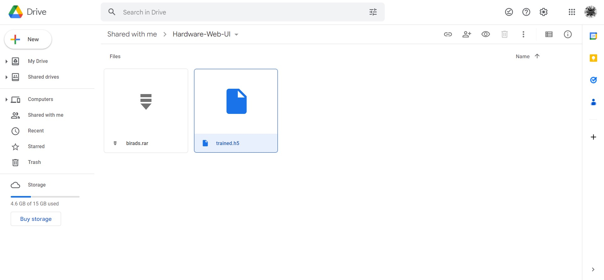
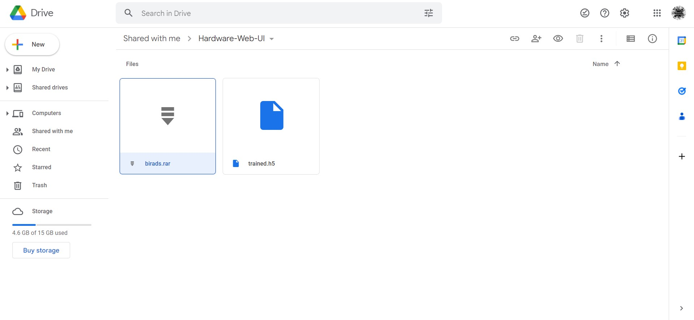

# Hardware Web UI

<p align="center">
    
</p>

A graphical user interface (GUI) that is built on the Web and used to communicate with the Breast Cancer Detection Neural Network.

**Table of Contents**:

- [Preface](#-preface)
- [Getting Started](#-getting-started)
  - [Prerequisites](#prerequisites)
  - [Clone this Repository](#clone-this-repository)
  - [Install Packages & Dependencies](#installing-packages--dependencies)
  - [Start Application](#start-application)
- [Features](#-features)
  - [GUI](#gui-features)
  - [Background](#background-features)
- [Contributing](#-contributing)
  - [Project Contributors](#project-contributors)
- [License](#-license)
- [Reference Links](#-reference-links)

## 💡 Preface

Connected to the Electronics and Communications Engineering department of SRM University of Technology and Science. The primary goal of this project is to build a user interface for the neural network that detects breast cancer.

The PYNQ Z-Series is a piece of hardware that will include the model itself. Given that PYNQ doesn't have its own user interface (UI), apart from launching a Jupyter Lab instance, a custom UI must be built in order to interact with the model.

Given the lack of an interactive UI, it is necessary to expose the GUI operating on the hardware's localhost via tunnelling traffic through Ngork to an external URL.

A Detailed User flow can be found in this document: https://docs.google.com/document/d/1IivIdJVi4lIbQ7dDW5LLaVy5koxrnJvxyAccIjbs0fk/edit?usp=sharing

## 🚀 Getting Started

### Prerequisites

Verify that all software and hardware prerequisites have been installed on your testing machine before beginning testing of the application.

> \* - Required

- Python *\** - [https://www.python.org/downloads/](https://www.python.org/downloads/)
- Ngrok *\** - [https://ngrok.com/download](https://ngrok.com/download)
- Node.js (optional) - [https://nodejs.org/en/download/](https://nodejs.org/en/download/)
- File/s Setup */(optional) - [https://drive.google.com/drive/folders/1Sl2l4uWqLrOUJjuUKNSgBb98kMr_Tj0Y](https://drive.google.com/drive/folders/1Sl2l4uWqLrOUJjuUKNSgBb98kMr_Tj0Y)

| Weighted `.h5` * | Data Set (optional) |
| :---: | :---: |
|  | |
| Required to be present in the project root as `trained.h5`. | If you wish to create your own weighted pretrained model, you'll need to use this data set to get started. |

### Clone this Repository

```bash
git clone https://github.com/kunalkeshan/Hardware-Web-UI.git
```

### Installing Packages & Dependencies

#### Python packages

```bash
pip install -r requirements.txt
```

#### Client dependencies

- Change directory to the client directory.

```bash
cd client
```

- Install using Yarn.

```bash
yarn
```

- Install using NPM.

```bash
npm install
```

### Start Application

- In the project root, run the following command. This will start up the server and serve the client build app located in the `static` folder.

Visit `http://localhost:8000` to view the application.

```bash
py main.py
```

- For running the client app alone, do the following.

Open the client directory.

```bash
cd client
```

Start using Yarn.

```bash
yarn start
```

Start using NPM.

```bash
npm start
```

## 🦾 Features

This GUI is build using **React ⚛ + TypeScript** and is served using **Python 🐍 + FastAPI**. Internally it uses it's own packages such as `react-router-dom` and `axios` in the client side, and `python-dotenv` and `pyngrok` in the server side.

### GUI Features

| Upload Image | Image Controls | Get Image Prediction | Print Predicted Data | Simple and Clean UI |
| --- | --- | --- | --- | --- |
| To upload a single image, simply click the "Upload Image" button. | You can adjust the image to your liking by using the image controls to pan, tilt, and zoom. | When you're ready to conduct the neural network analysis on your uploaded image, click the run model button. | After making a forecast, you can examine the refined information and even print it out to give it an air of authority. | Simple, uncluttered, and intuitive to use. |

### Background Features

| Facilitates image uploads | Image Processing | Delete old images |
| --- | --- | --- |
| Manage uploaded images with FastAPI's built-in file manager, and save them together with relevant metadata. | Image processing employing weighted, pre-trained models derived from a guaranteed data set. | Deletes obsolete photos mechanically to save space on the hardware. |

## 🤖 Contributing

Anybody is free to contribute to this repo. If you think that you can improve the model or the gui, follow the contributing guidelines mentioned at [CONTRIBUTING.md](/CONTRIBUTING.md)

### Project Contributors

<a href="https://github.com/kunalkeshan/Hardware-Web-UI/graphs/contributors">
  
</a>

## 🔐 License

This project is licensed under the [MIT License](/LICENSE).

### Forking this Repo?

Many people have contacted us asking if they can use this code for their own websites. The answer to that question is usually "yes", with attribution. There are some cases, such as using this code for a business or something that is greater than a personal project, that we may be less comfortable saying yes to. If in doubt, please don't hesitate to ask us.

We value keeping this project open source, but as you all know, plagiarism is bad. We actively spend a non-negligible amount of effort developing, designing, and trying to perfect this iteration of our project, and we are proud of it! All we ask is to not claim this effort as your own.

So, feel free to fork this repo. If you do, please just give us proper credit by linking back to this repo, [https://github.com/kunalkeshan/Hardware-Web-UI](https://github.com/kunalkeshan/Hardware-Web-UI). Refer to this handy [quora](https://www.quora.com/Is-it-bad-to-copy-other-peoples-code) post if you're not sure what to do. Thanks!

## 🔗 Reference Links

- Install Ngrok in Linux:

```bash
curl -s https://ngrok-agent.s3.amazonaws.com/ngrok.asc | sudo tee /etc/apt/trusted.gpg.d/ngrok.asc >/dev/null && echo "deb https://ngrok-agent.s3.amazonaws.com buster main" | sudo tee /etc/apt/sources.list.d/ngrok.list && sudo apt update && sudo apt install ngrok
```
